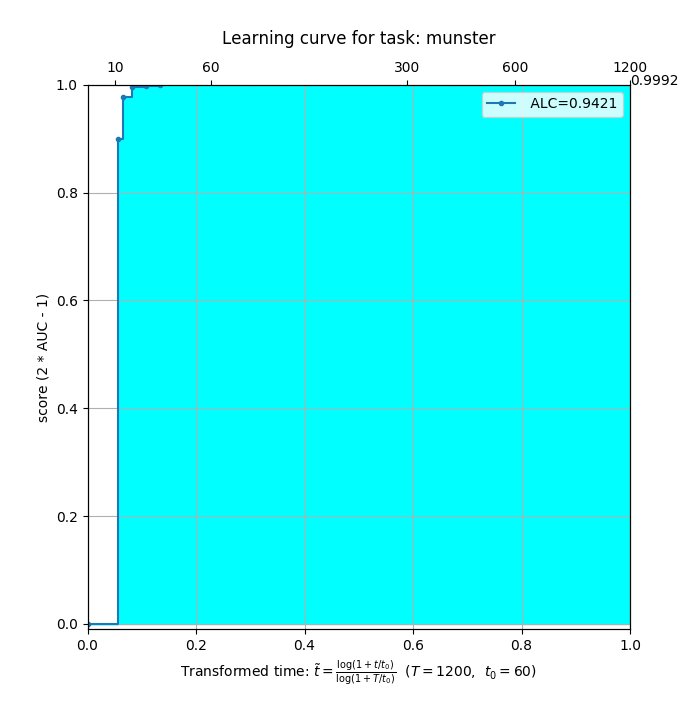
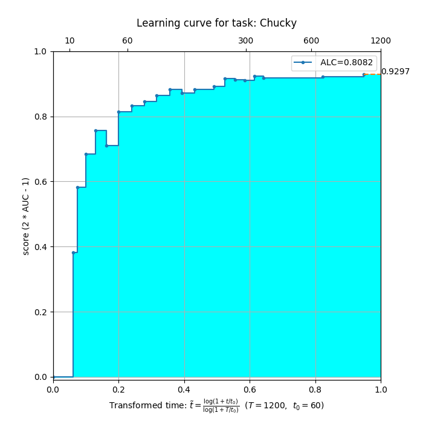
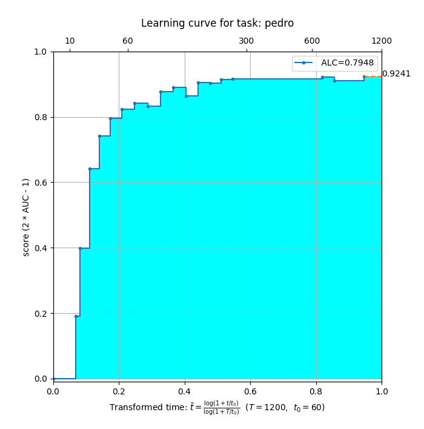
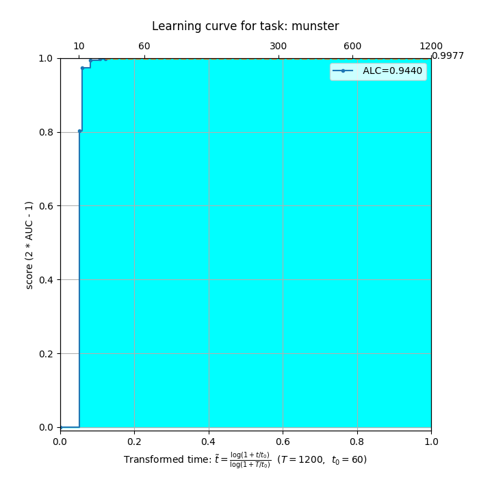
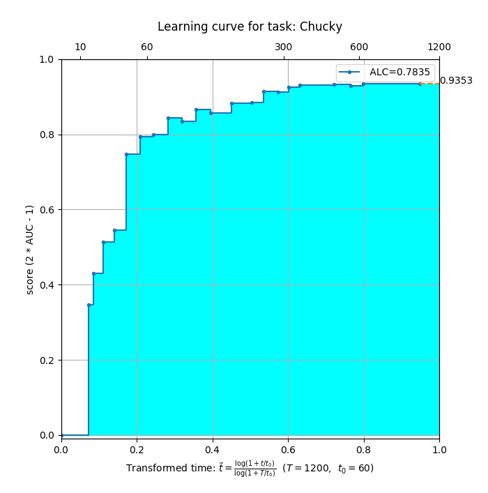
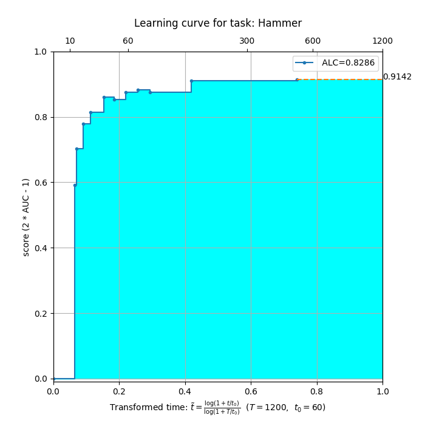
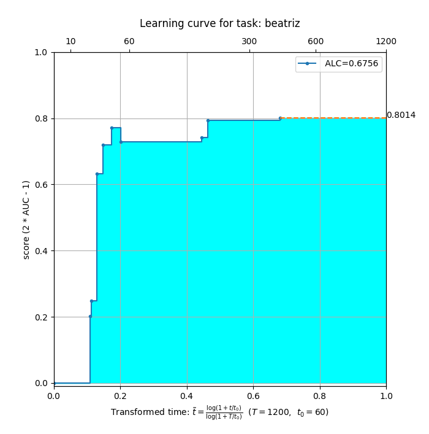
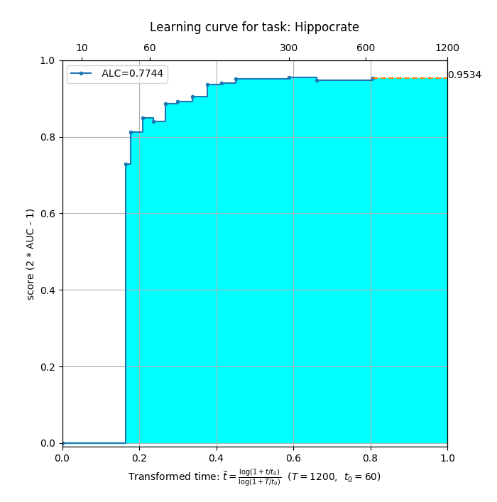
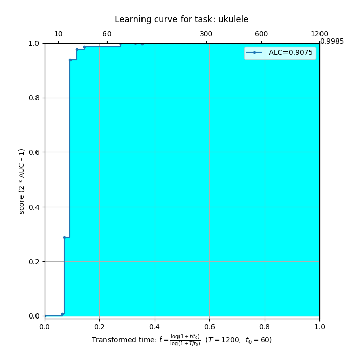

# AutoCV2019
[](http://kakaobrain.com/)
[](https://pytorch.org/)
[](https://www.tensorflow.org/)

A special designed **[Fast AutoAugment][]** is implemented to adapt to **various tasks** while paying attention to **limited resources**.


## [AutoCV Challenge][] Introduction
#### Fully Automated Image Classification without ANY human intervention
> Despite recent successes of deep learning and other machine learning techniques, practical experience and expertise is still required to select models and/or choose hyper-parameters when applying techniques to new datasets. This problem is drawing increasing interest, yielding progress towards fully automated solutions. In this challenge your machine learning code is trained and tested on this platform, without human intervention whatsoever, on image classification tasks you have never seen before, with time and memory limitations. All problems are multi-label classification problems, coming from various domains including medical imaging, satellite imaging, object recognition, character recognition, face recognition, etc. They lend themselves to deep learning solutions, but other methods may be used. Raw data is provided, but formatted in a uniform manner, to encourage you to submit generic algorithms.


## Methods
### Network architecture

The [AutoCV Challenge][]s are given limited memory and computational resources. Thus, we considered a small size of architecture that could use the pre-trained models that were transferred.

We have discovered the best hyper parameters and architectures to get the best performance in five minutes from five public data sets(Munster, Chuckey, Pedro, Decal and Hammer). No data augmentation nor advanced techniques are used.

Due to the large differences in image size (median shape 28x28x1 for munster vs. 576x944x3 for decal) the input tensor size must be automatically adapted for each dataset to allow for adequate aggregation of spatial information and to keep the aspect ratio of original image.
We automatically adapt these parameters to the median size of each dataset, so that the network effectively trains on entire datasets. Due to time constraints, we do not increase the input tensor volume (without channels) beyond 64^2. If the median shape of the dataset is smaller than 64^2 then we use the median shape as original input.

|    | Munster |  Chucky |   Pedro |   Decal |  Hammer |
|:---|:-------:|:-------:|:-------:|:-------:|:-------:|
| <sub>original median shape<sub> | 28x28x1 | 32x32x1 | 203x74x3 | 576x944x3 | 300x400x3 |
| <sub>input tensor shape<sub> | 28x28x1 | 32x32x1 | 128x48x3 | 48x64x3 | 48x64x3 |

### Limited [Fast AutoAugment][]

The original Fast AutoAugment learns augmentation policies using a more efficient search strategy based on density matching. Ideally, The [Fast AutoAugment][] should be performed automatically, allowing the training data to adapt to test data.

We proposed reducing the search space to reduce computational resources.

Just like the original Fast AutoAugment, we search the augmentation policies that match the density of train with density of augmented valid. We deviate from the original in that we replace K-fold with 1-fold and use random search (within subset of searched policy in original) instead of bayesian optimization.


## Results
### Public

#### V1.XLARGE
* experiment environment: [BrainCloud][] V1.XLARGE Type (V100 1GPU, 14CPU, 122GB)
| metrics | Munster |  Chucky |   Pedro |   Decal |  Hammer |
|:-------:|--------:|--------:|--------:|--------:|--------:|
| ALC     |  0.9818 |  0.8633 |  0.8300 |  0.8935 |  0.8764 |
| <sub>2*AUC-1</sub> |  0.9976 |  0.9292 |  0.9147 |  0.9247 |  0.9106 |
| curves  |  |  |  |  |  |

#### P1.XLARGE
* experiment environment: [BrainCloud][] P1.XLARGE Type (P40 1GPU, 6CPU, 61GB)
| metrics | Munster |  Chucky |   Pedro |   Decal |  Hammer |
|:-------:|--------:|--------:|--------:|--------:|--------:|
| ALC     |  0.9440 |  0.7835 |  0.7366 |  0.8353 |  0.8286 |
| <sub>2*AUC-1</sub> |  0.9977 |  0.9353 |  0.9214 |  0.9347 |  0.9142 |
| curves  |  |  |  |  |  |

### Private
* experiment environment: [CodaLab](https://autodl.lri.fr/) (UNKNOWN)
| metrics | beatriz | Caucase | Hippoc. |  Saturn | ukulele |
|:-------:|--------:|--------:|--------:|--------:|--------:|
| ALC     |  0.6756 |  0.7359 |  0.7744 |  0.8309 |  0.9075 |
| <sub>2*AUC-1</sub> |  0.8014 |  0.9411 |  0.9534 |  0.9884 |  0.9985 |
| curves  |  |  |  |  |  |


## Environment Setup & Experiments
* base docker environment: https://hub.docker.com/r/evariste/autodl

* pre requirements
```
apt update
apt install python3-tk
```

* clone and init. the repository
```bash
$ git clone https://github.com/kakaobrain/autocv2019 && cd autocv2019
$ # 3rd parties libarary
$ git submodule init
$ git submodule update
$ # download pretrained models
$ wget https://download.pytorch.org/models/resnet18-5c106cde.pth -O ./models/resnet18-5c106cde.pth
$ # download public datasets
$ cd autodl; python download_public_datasets.py; cd ..
```

* run public datasets
```bash
$ python autodl/run_local_test.py -time_budget=1200 -code_dir='./' -dataset_dir='autodl/AutoDL_public_data/Munster/'; cp autodl/AutoDL_scoring_output/learning-curve-*.png ./results
$ python autodl/run_local_test.py -time_budget=1200 -code_dir='./' -dataset_dir='autodl/AutoDL_public_data/Chucky/'; cp autodl/AutoDL_scoring_output/learning-curve-*.png ./results
$ python autodl/run_local_test.py -time_budget=1200 -code_dir='./' -dataset_dir='autodl/AutoDL_public_data/Pedro/'; cp autodl/AutoDL_scoring_output/learning-curve-*.png ./results
$ python autodl/run_local_test.py -time_budget=1200 -code_dir='./' -dataset_dir='autodl/AutoDL_public_data/Decal/'; cp autodl/AutoDL_scoring_output/learning-curve-*.png ./results
$ python autodl/run_local_test.py -time_budget=1200 -code_dir='./' -dataset_dir='autodl/AutoDL_public_data/Hammer/'; cp autodl/AutoDL_scoring_output/learning-curve-*.png ./results
```

* (optional) display learning curve
```bash
$ # item2 utils to visualize learning curve
$ wget https://www.iterm2.com/utilities/imgcat -O bin/imgcat; chmod 0677 bin/imgcat
$ bin/imgcat ./results/learning-curve-*.png
```

## Authors and Licensing
This project is developed by [Woonhyuk Baek][], [Ildoo Kim][] and [Sungbin Lim][] at
[Kakao Brain][]. It is distributed under [Apache License
2.0](LICENSE).


## Citation
If you use any part of this code in your research, please cite our [paper](https://arxiv.org/abs/1905.00397).
```
@article{lim2019fast,
  title={Fast AutoAugment},
  author={Lim, Sungbin and Kim, Ildoo and Kim, Taesup and Kim, Chiheon and Kim, Sungwoong},
  journal={ICML AutoML workshop},
  year={2019}
}
```

## References & Open sources
1. [Fast AutoAugment][]
    - paper: https://arxiv.org/abs/1905.00397
    - codes: https://github.com/kakaobrain/fast-autoaugment
2. Pretrained models for Pytorch
    - codes: https://github.com/Cadene/pretrained-models.pytorch
3. TorchVision models
    - pages: https://pytorch.org/docs/stable/torchvision/models.html
3. TQDM: Progress Bar for Python and CLI
    - codes: https://github.com/tqdm/tqdm
4. AutoCV/AutoDL startking kit
    - codes: https://github.com/zhengying-liu/autodl_starting_kit_stable

[Kakao Brain]: https://kakaobrain.com/
[BrainCloud]: https://cloud.kakaobrain.com/
[Sungbin Lim]: https://github.com/sungbinlim
[Ildoo Kim]: https://github.com/ildoonet
[Woonhyuk Baek]: https://github.com/wbaek
[Fast AutoAugment]: https://github.com/kakaobrain/fast-autoaugment
[AutoCV Challenge]: https://autodl.lri.fr/competitions/118#home
